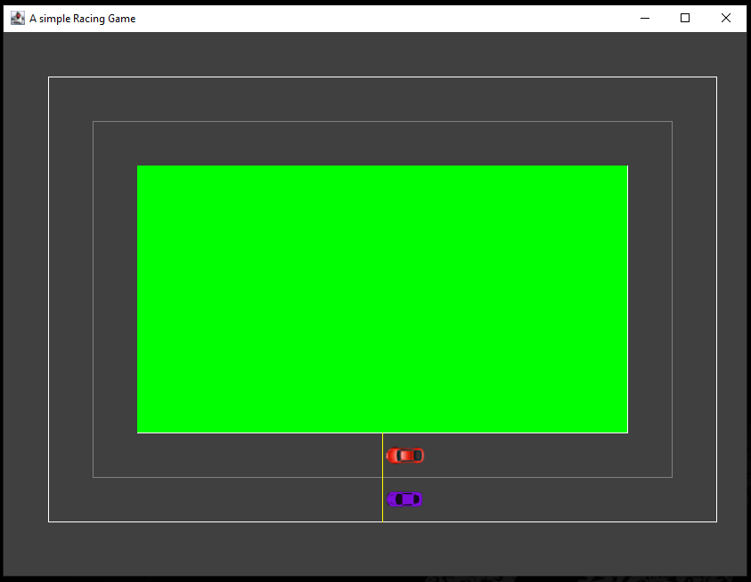
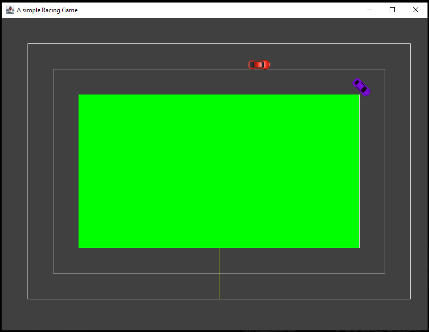

# Cristin's Homepage

[https://github.com/cr1d3v](https://github.com/cr1d3v)

## The Project Idea

The following application was my first-ever attempt at working with [Java](https://en.wikipedia.org/wiki/Java_(programming_language)) and familiarizing myself with [IntelliJ IDEA](https://www.jetbrains.com/idea/). The goal of the following project was to develop a racing game that allows 2 players to drive 2 karts around a drawn race track using one workstation by sharing a common keyboard with different sets of keys.

Faced difficulties?
<br>
Java is quite similar to C# semantically and syntactically, therefore the biggest difficulties faced were learning the [IntelliJ IDEA](https://www.jetbrains.com/idea/) interface as well as some minor syntax differences. As for the project itself, I had a few failed attempts at importing the .png files for the go_karts used as well as fine-tuning the karts turning points. 

How can the following application be improved?
<br>
There's a huge stream of ideas that comes to mind however a good starting point would be the implementation of collision detection. The following feature was something that I have attempted to implement but unfortunately have not finished as of yet.

## Demo

Hey 👋, I left some screengrabs below, check them out!

<p align="center">

</p>

---

<p align="center">

</p>

## Stack

- [Java](https://en.wikipedia.org/wiki/Java_(programming_language)) - A general-purpose programming language designed by [Sun Microsystems, Inc.](https://en.wikipedia.org/wiki/Sun_Microsystems)

## User Guide on How to Run the Application ? 

To run the application, follow the steps bellow:

Step 1:
Navigate towards the following directory path .../single_player_kart_game/out/single_player_kart_game_jar/single_player_kart_game.jar
Step 2:
Execute the .jar file!

P.S: In essence the 'jar' file is the java applications packaged into a single file. To run .jar files, make sure you have [Java Runtime Environment](https://www.java.com/en/download/manual.jsp) installed on your device.

Alternatively:

 you may want to import the application into an IDE for example the [IntelliJ IDEA](https://www.jetbrains.com/idea/) that was used to develop the application itself. In order to do so you will require to import the entire root directory i.e., single_player_kart_game folder. If an error occurs, make sure that the src folder has the 3 crucial files i.e., Main.Java, RaceCars.Java, RacingPanel.Java and raceCarImg folder.

 ## User Guide on Game Controls ? 
```
Purple Car Controls:
W – Increase Speed
S – Decrease Speed
A – Turn Left
D – Turn Right

Red Car Controls:
 ↑   (Up Arrow) – Increase Speed
 ↓   (Down Arrow) – Decrease Speed
←  (Left Arrow) – Turn Left
→  (Right Arrow) – Turn Right
```

---

Thank you for having a look!
